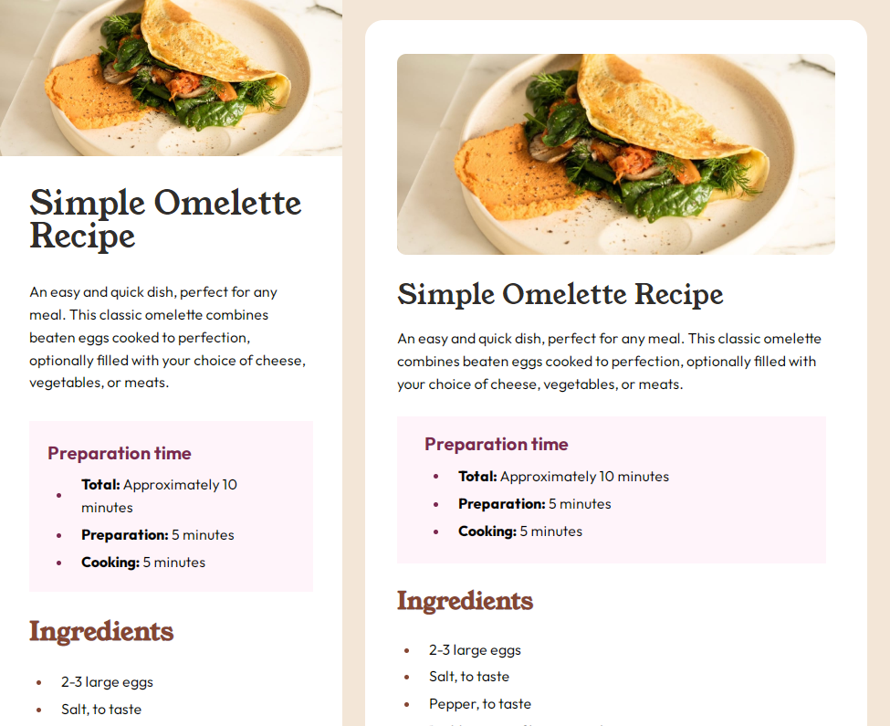
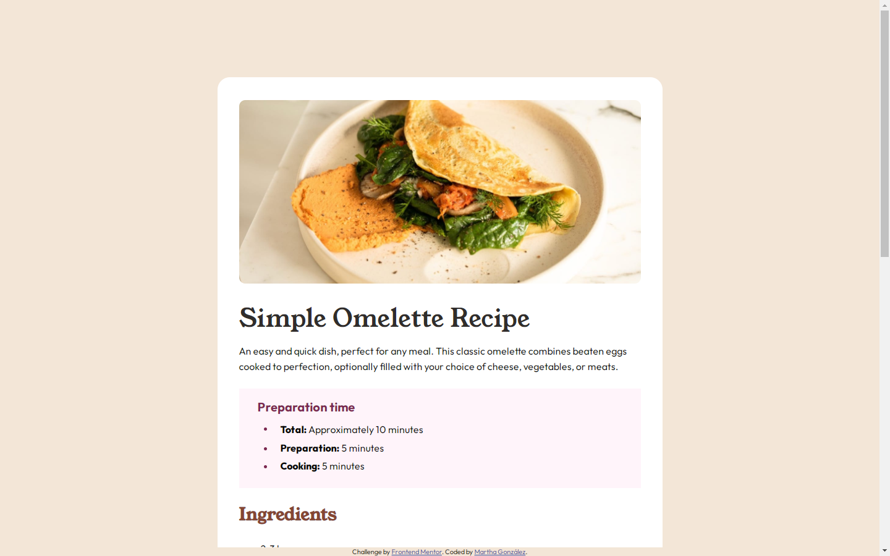

# Frontend Mentor - Recipe page solution

This is a solution to the [Recipe page challenge on Frontend Mentor](https://www.frontendmentor.io/challenges/recipe-page-KiTsR8QQKm). Frontend Mentor challenges help you improve your coding skills by building realistic projects. 

## Table of contents

- [Overview](#overview)
  - [The challenge](#the-challenge)
  - [Screenshot](#screenshot)
  - [Links](#links)
- [My process](#my-process)
  - [Built with](#built-with)
  - [What I learned](#what-i-learned)
  - [Continued development](#continued-development)
  - [Useful resources](#useful-resources)
- [Author](#author)
- [Acknowledgments](#acknowledgments)

**Note: Delete this note and update the table of contents based on what sections you keep.**

## Overview

### Screenshot

### Links

- Solution URL: [Repository](https://github.com/margga88/recipe-page)
- Live Site URL: [Add live site URL here](https://your-live-site-url.com)

## My process

### Built with

- Semantic HTML5 markup
- CSS custom properties
- Flexbox
- Mobile-first workflow
- CUBE CSS methodology

### What I learned

This might be one of those projects that really put me, my better judgement, and my skills to the test.

- One of the first challenges I had when building the layout for this project was deciding between flexbox or grid, which one was better for the entire project. Took my time to review grid, but then found out that flexbox served better for the purpose of this project than grid, or at least in my current point of practice.

- Cube CSS methodology once again proved to be really useful when it came to put some order regarding the building of this project. It was easier to apply this time.

- Oh, the bullet alignment was quite a challenge, which led to several tests, until I finally with the resource and property that would serve for the purpose.

- Then my judgement was put to the test again, regarding leaving this project just until the basic required sizes were met or not. So, it was decided that media queries for 600px and 768px would be added, in order to work for all (or most) screen sizes. It was a great practice on media queries. 

### Continued development

I can't wait to work on other projects, to keep learning, testing more of my skills, and get to the point where I build something really useful.

### Useful resources

- [Get your bullets aligned](https://idkshite.com/posts/vertical-center-bullet) - This was really helpful to solve the issues on bullet alignment.

## Author

- Frontend Mentor - [@margga88](https://www.frontendmentor.io/profile/margga88)

## Acknowledgments

To all the Frontend Mentor community for their advice.
